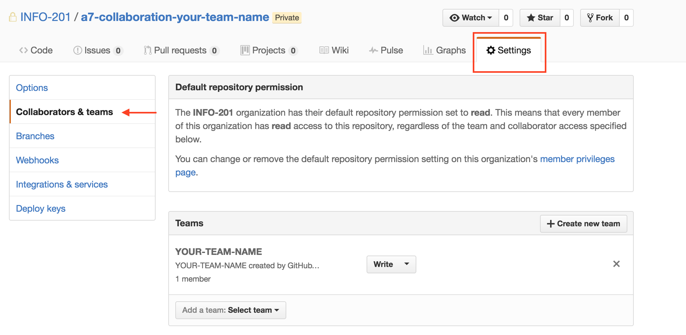
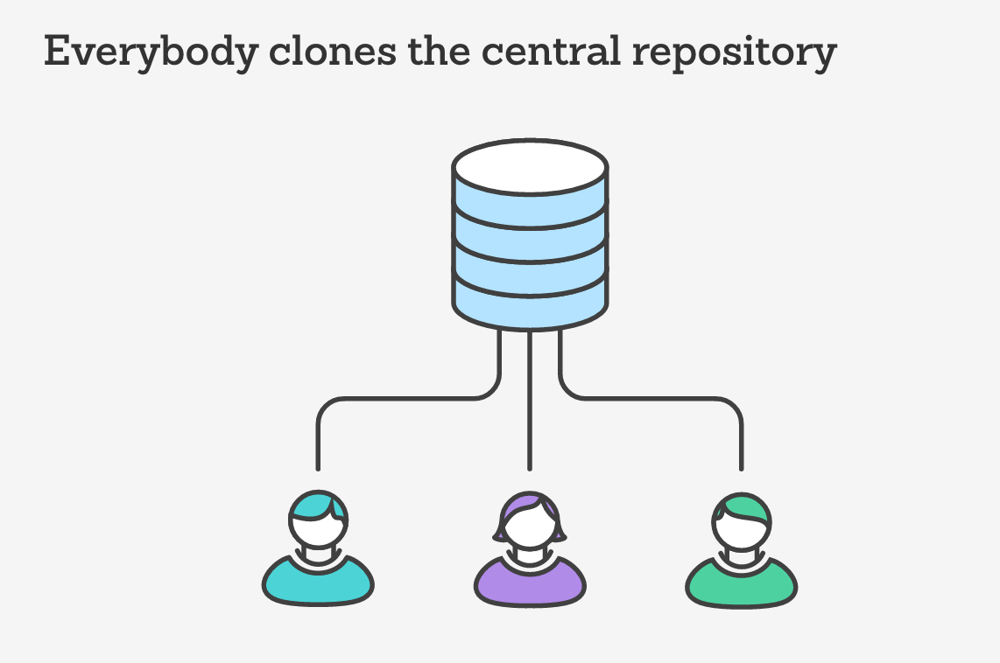
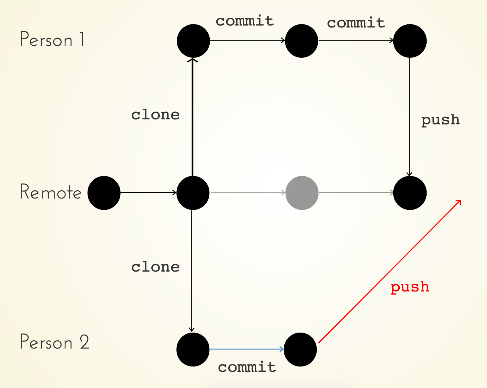
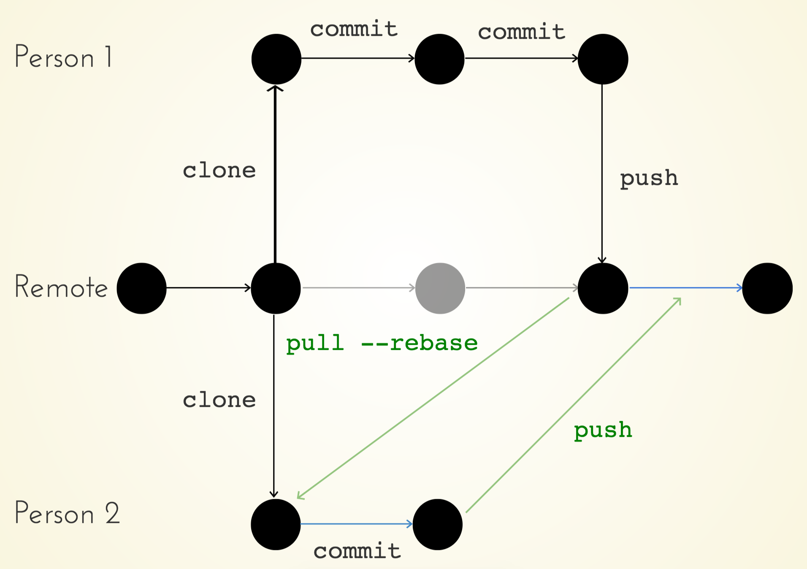
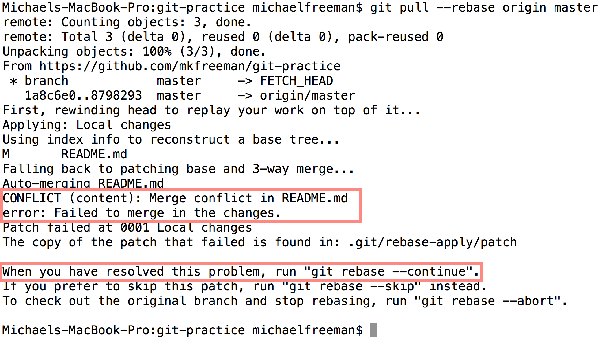

# Module 13: Git Collaboration

## Overview
One of the most important aspects of a version control system is the ability to collaborate with others on projects. There are a variety of approaches to collaborating using git and GitHub, and in this course we'll introduce using a [centralized workflow](https://www.atlassian.com/git/tutorials/comparing-workflows/centralized-workflow) (however, feel free to use an alternate approach if you prefer). In order to begin collaboration, you need to understand how to structure your repositories, integrate changes from others, and deal with any conflicts that may arise.

<!-- START doctoc generated TOC please keep comment here to allow auto update -->
<!-- DON'T EDIT THIS SECTION, INSTEAD RE-RUN doctoc TO UPDATE -->
**Contents**

- [Resources](#resources)
- [Repository Set up](#repository-set-up)
- [Rebasing](#rebasing)
- [Resolving Conflicts](#resolving-conflicts)
- [GitHub Issues](#github-issues)
- [Branches](#branches)

<!-- END doctoc generated TOC please keep comment here to allow auto update -->

## Resources
- [Centralized Workflow](https://www.atlassian.com/git/tutorials/comparing-workflows/centralized-workflow)
- [Merging v.s. Rebasing](https://www.atlassian.com/git/tutorials/merging-vs-rebasing)
- [GitHub Issues](https://guides.github.com/features/issues/)
- [Closing issues with commits](https://help.github.com/articles/closing-issues-via-commit-messages/)
- [Git Branches](https://www.atlassian.com/git/tutorials/using-branches/)
- [Essential Git (from Joel Ross)](https://info343-au16.github.io/#/tutorials/git)

## Repository Set up
To leverage a centralized workflow, **all team members will use the same remote repository** on GitHub. Once you have created a repository, you'll need to **add each team member** as a collaborator on GitHub, which will allow all people to push to the repository:



Once you've added all members to the GitHub repository, everyone should   clone (**not fork and clone**) the same repository (image [source](https://www.atlassian.com/git/tutorials/comparing-workflows/centralized-workflow)):



At this point, all members should have read/write access to the same repository up on GitHub, and they should have it cloned to their machines. Importantly, the remote version of the code (on GitHub) should be considered the **single source of truth**, and should always contain the most up to date (functioning)
 version of the code.

## Rebasing
When working on the same project as other individuals, it's possible that you'll both be working on the same files at the same time. When someone else pushes changes to GitHub, you'll need a way to incorporate those changes into your stream of work. _Rebasing_ will provide us with a mechanism for _pulling down changes_ from GitHub to our local machine, and then adding our own work on top of those changes.

For example, imagine two people both pushing to the same remote. The diagram below depicts a common occurrence in which both people begin working from the same commit, and then Person One pushes changes up to GitHub. Person 2 is then no longer working on top of the most up to date version of the code. If they attempt to push changes up to GitHub, they will be rejected:



The push from Person 2 will be rejected because they have not incorporated the changes in the remote. Luckily, **rebasing** provides a mechanism for pulling down changes from GitHub, then applying local commits on top of them:



In this diagram, Person 2 is able to push their work up to the remote branch _only after_ incorporating the changes that Person 1 had made. To do this, they would use the following code:

```bash
# Person 2: add and commit local changes
git add .
git commit -m "Made changes"

# Rebase project from remote (origin) into master branch
git pull --rebase origin master

# Test your code to make sure it runs as expected!!!!!

# Push up changes to master
git push origin master
```

This section of code would replay the `Made Changes` commit _on top of_ whatever had changed on the remote. However, if Person 1 and Person 2 edited the same line of code, Person 2 would have to resolve a conflict as part of the rebase process. Note, just because the rebase executes without a conflict, **it does not mean that your code runs as expected**. Be sure to **test out your code** before pushing back up to GitHub.

To practice simple rebasing, see [exercise-1](exercise-1).

## Resolving Conflicts
If git does not detect edits to the same line of code, it will be able to perform a rebase without any conflict. However, **this does not mean that your code functions as you expect**, so you'll need to confirm that appropriately. If multiple people do edit the same line of code, a _conflict_ will arise, which you will have to resolve. You'll be notified of this when you attempt to rebase your code:



Git will provide you with a helpful error message notifying you of your error. **Don't panic**. If you want to stop the rebase process and revert to the point before you attempted a rebase, you can always enter the command `git rebase --abort`. However, at this point you can move forward with the rebase process. Git **will change your files** with merge conflicts to highlight the lines that have been changed locally and on the remote. It will look something like this:


Let's take a look at this. Wherever you have a conflict, git will notify you with this symbol: `<<<<<<<` (it's hard to miss). You then have the code from your `HEAD` (remote branch). This may be multiple lines of code. The remote and local branches are divided by a line of equal signs (`=======`), followed by the local code version. The merge conflict is then closed with this symbol: `>>>>>>>`.

This may seem strange, but you should **open up your file and make the edits you find appropriate**. This means deleting all of the strange symbols git has added (`<<<<<<<`,`=======`, `>>>>>>>`) and leaving the code **exactly how you want it to appear**. At this point, your code should run smoothly (and you should test it). As indicated in the error message provided, we need to **add** our changes, and then continue our rebase with `git rebase --continue`. We can then push our changes (the ones that have been applied on top of the remote branch) up to GitHub:

```bash
# Add and commit local changes
git add .
git commit -m "Local changes"

# Attempt to push
git push origin master # doesn't let us push!

# Pull in and rebase remote changes
git pull --rebase origin master # oh no! conflict!

# Make manual changes in necessary files ----------

# Add changes that you've made to the rebase
git add .

# Continue (complete) the rebase process
git rebase --continue

# Push (integrated) changes up to GitHub
git push origin master
```

To practice resolving conflict, see [exercise-2](exercise-2).

## GitHub Issues
A great way to keep track of tasks you need to complete (or small bugs in your code) is with [GitHub issues](https://guides.github.com/features/issues/). These are visible under the **Issues** tab of a project on GitHub. You can assign these to particular group members, comment on them, and even [close issues with commit messages](https://help.github.com/articles/closing-issues-via-commit-messages/). We'll strongly urge you to keep track of to-do items via GitHub issues.

## Branches
We won't explicitly use branches as part of the collaborative development process, but they're a popular approach to building independent project features (see: [feature branch workflow](https://www.atlassian.com/git/tutorials/comparing-workflows/feature-branch-workflow)), or creating separate streams of development. A _branch_ in GitHub is a way of **labeling a sequence of commits**. You can create labels (branches) for different commits, and effectively have different "lines" of development occurring in parallel and diverging from each other.

To create a new branch _from your current branch_, you can use the `git branch` command:

```bash
# Create a new branch called my-branch
git branch my-branch

# Checkout (start working in) my-branch
git checkout my-branch
```

Alternatively, you could perform both of the above steps in one line using the `-b` flag in the `git checkout` command:

```bash
# Create and checkout a new branch called my-branch
git checkout -b my-branch
```

Commonly, your primary stream of development will be your `master` branch, and you can experiment with new ideas in _feature_ branches (i.e., `cool-idea` branch). If you successfully complete a feature on a separate branch and want to merge those changes into master, you'll first **checkout** your master branch, then **merge changes into it**. For example:

```bash
# Doing work on your cool-idea branch
git add .
git commit -m "Finished my cool idea"

# Checkout your master branch
git checkout master

# Merge in your changes from cool-idea into master
git merge cool-idea
```

Again, if there are no lines that have been edited on different branches, git will perform the merge without any issues. However, if the same line has been edited in multiple branches, you'll have a **merge conflict**.

Luckily, you'll resolve a merge conflict using a very similar process to a rebase conflict. However, once you make your changes, you'll need to **add and commit** those changes. For example:


```bash
# Make and checkout new branch
git checkout -b my-branch

# Make some changes to your file, then add and commit
git add .
git commit -m "Made changes over here"

# Switch back to master branch
git checkout master

# Make some changes, then add and commit
git add .
git commit -m "Made changes to master"

# Merge in changes from my-branch branch
git merge my-branch

# Resolve the conflict MANUALLY in the file, then add and commit
git add .
git commit -m "Merged in changes fro my-branch branch"
```

To practice merging branches, see [exercise-3](exercise-3).
